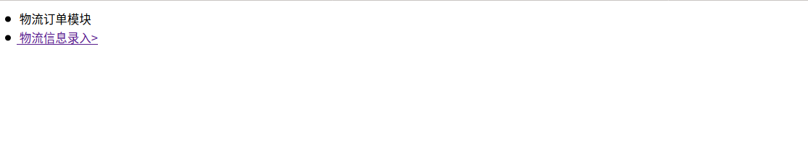
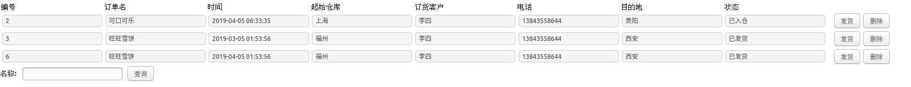
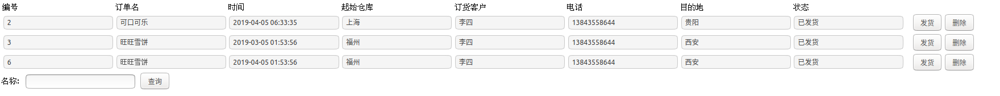
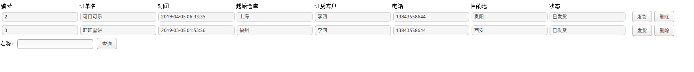
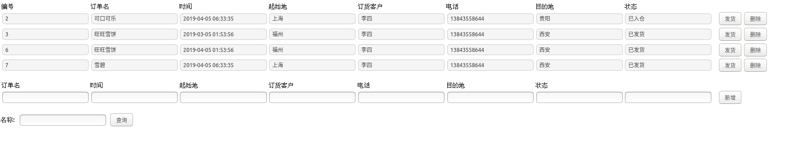

# python-test

整理的框架来自@Ge。

这修改了@wwb的订单程序，产生了物流程序。

下面仅仅展示流程。

## 登录

**用物流信息的身份登录**，进入物流的index.html界面

## 物流信息

点击上面的“物流信息录入”链接，进入订单展示界面。

作为物流公司的身份，**仅仅能看到“已入仓”，“已发货”的物流信息。**

## 切换物流的状态

点击上面的发货按钮，显示发货成功。

点击返回

**已入仓的物流状态会转换成已发货。**

## 删除

## 查询

## 增加

